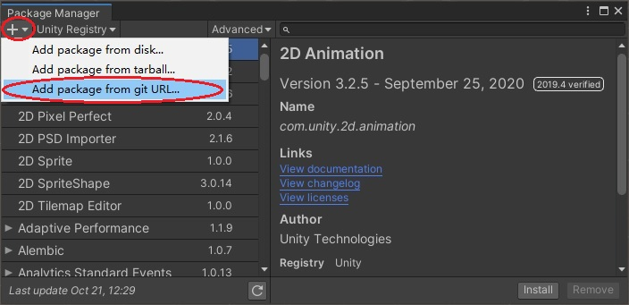
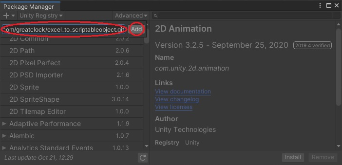
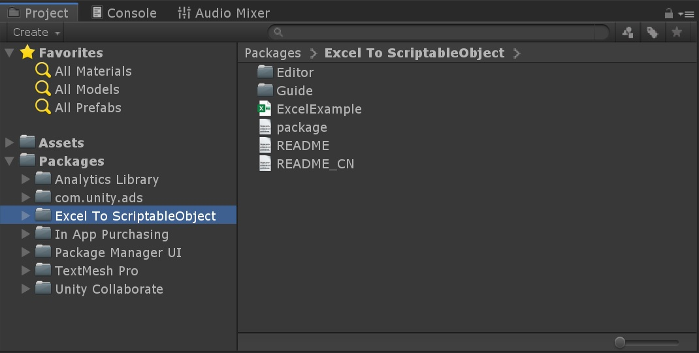

# Guiding in Progress


## Import package into Unity project using Git repository

**Note: ** Using Git repository is not the only way to import this package into your project. You can also download the code and dlls into your project, or import the package from your remote npm where this package is deployed.

**Option 1 (all versions of Unity that supports Package Manager is OK) :**

1. Open Packages/manifest.json in your project with any text editor

2. Insert a new line as below into "dependencies"

   ```json
   {
     "dependencies": {
       "com.greatclock.exceltoscriptableobject": "git+https://github.com/greatclock/excel_to_scriptableobject.git",
       ...
     }
   }
   ```

3. Save the file Packages/manifest.json
4. Back to Unity, and the package will be imported automatically

**Option 2 (Unity2019 or newer only) :**

1. Open "Package Manager" and click the "+" button on the left top. And then select "Add package from git URL..."

   

2. Fill in the blank with "https://github.com/greatclock/excel_to_scriptableobject.git" and then click "Add" button

   

A folder named "Excel To ScriptableObject" will be presented in Packages of Project window after the package imported into Unity.




## Contents in Guiding

### 1. Basic Usages

In this guiding, we are going to make a ".xlsx" file that contains datas a bunch of students, including their basic information such as name, gender, and their parents' information with their phone number.

It aimed to show how basic data types, enum types, arrays and nested types are used in this tool.

#### 1.1 Reading data in Unity which fulfilled in a new xlsx file

[Guide1E1_EN.md](./Guide1E1_EN.md)

- The whole work flow
- Rules in all useful names
- Comments row in xlsx files
- Using basic data types and arrays
- Retrieving data in Unity and debugging data

#### 1.2 Using nested types

[Guide1E2_EN.md](./Guide1E2_EN.md)

- Multi sheets in one xlsx file
- Nesting data in sheets via id or key
- Hiding get method of a specific sheet to make it internally used only

#### 1.3 Using Enum types

[Guide1E3_EN.md](./Guide1E3_EN.md)

- Procedures in using enum types
- Defining enum values for enum types in sheet

### 2. Key to Multi Values

#### 2.1 Marking a sheet as "key to multi values" and reading all items that match

[Guide2E1_EN.md](./Guide2E1_EN.md)

- Dealing with special characters in various xlsx applications
- Avoiding GC alloc caused by creating 'List' when retrieving items

#### 2.2 When using nested types, the field defined as a custom type can be an array

[Guide2E2_EN.md](./Guide2E2_EN.md)

### 3. Extensions for String

#### 3.1 Multi-Language feature

[Guide3E1_EN.md](./Guide3E1_EN.md)

- Using multi-language string
- Using registered key-value translation function to make multi-language field available with nothing else to do

#### 3.2 Logical Rich-Text feature

**Note : ** Logical Rich-Text means : one or more segment of a string may be replaced with contents only of value at the time that the string shows. For example : player's nick name, player's current level. It's NOT used for dealing with text colors, sizes or in-text images.

[Guide3E2_EN.md](./Guide3E2_EN.md)

- Using logical rich-text string
- Using registered enrich function to make logical rich-text field available with nothing else to do

### 4. Filtering Fields in Sheet

Developing ...

