# 从创建新xlsx文件到在运行时读取其定义的数据

## 准备工作

1. 新建或打开Unity工程
2. 完成Excel To ScriptableObject工具的导入，并保证没有编译错误

## 操作流程

1. 在Unity工程目录中Assets文件夹旁边新建名为Excels的文件夹（文件夹名称可根据需要自行命名，推荐置于工程根目录中，以保证在Unity中可以通过相对路径进行文件查找）

2. 新建名为StudentsData.xlsx的表格文件

3. 修改Sheet名称为Student，填充数据并保存

   **注：** 一个xlsx表格文件中可包含多张表（Sheet），表的名称为Student表示此表中定义的所有数据均为Student类型。

   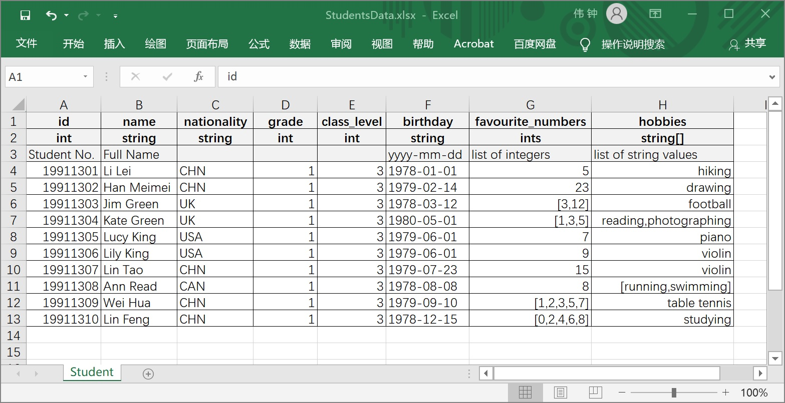

4. 回到Unity，打开工具配置界面

   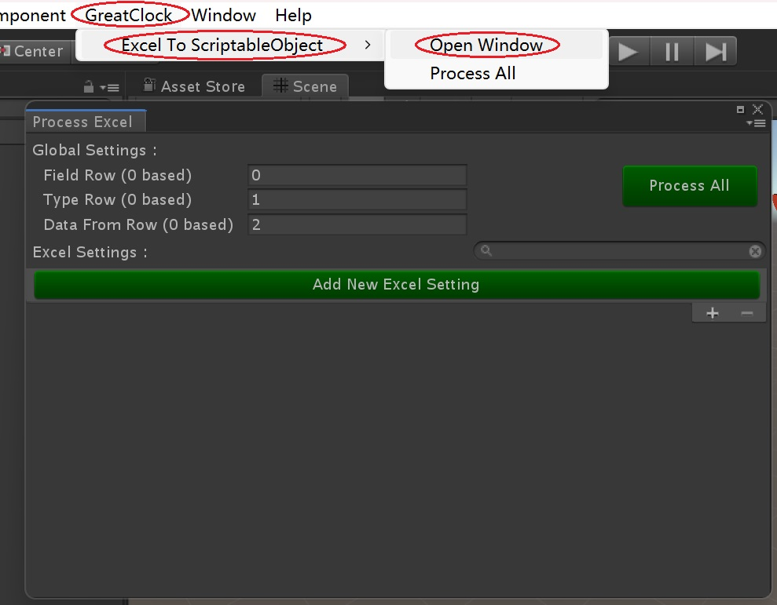

5. 修改全局配置，此示例中所有表首行表示字段名，第二行表示字段类型，第三行为注释，第四行起为数据。

   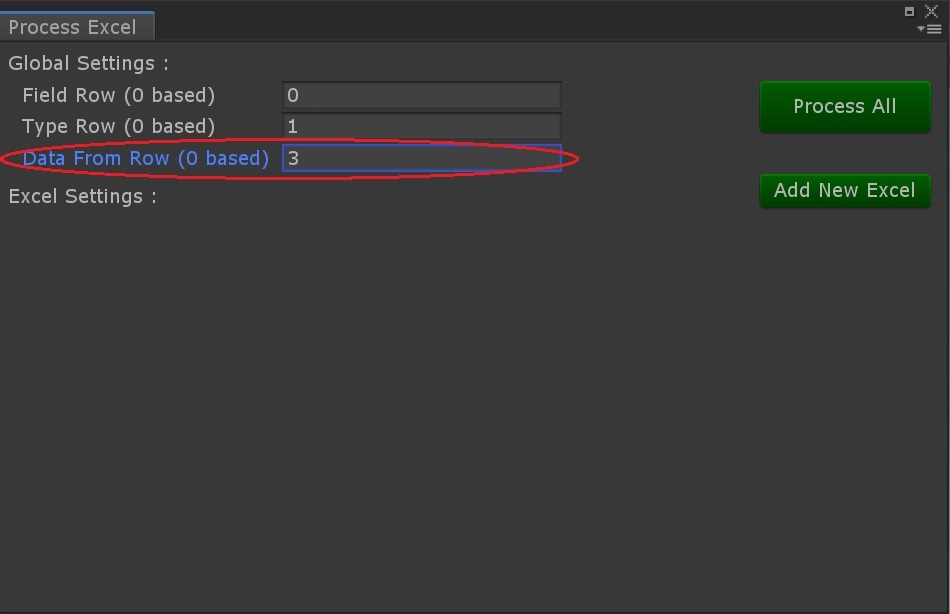 

6. 增加新的Excel文件配置

   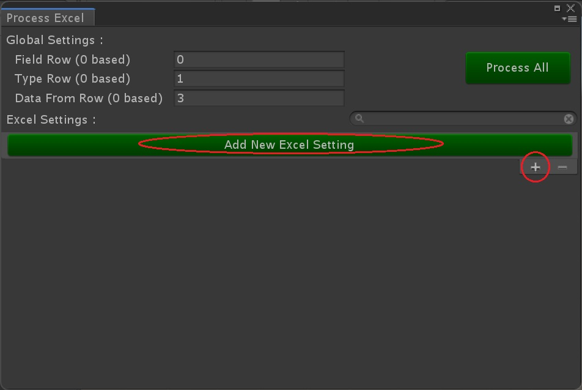

7. 选择刚刚保存的StudentsData.xlsx表格文件

   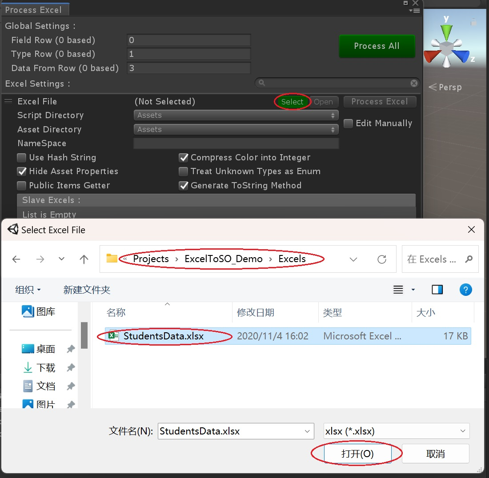

8. 指定生成的脚本、数据资源的路径，脚本命名空间（可为空）等

   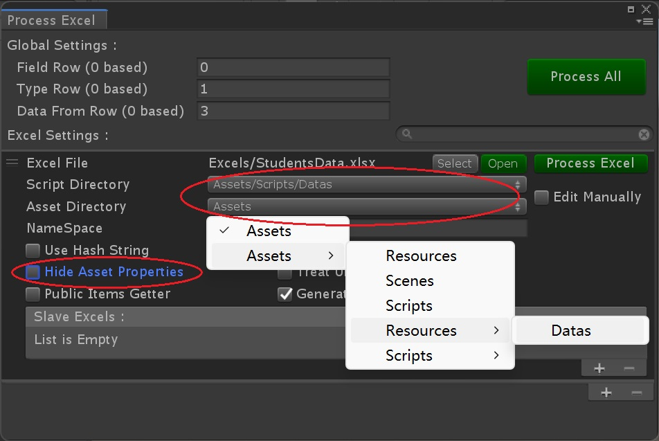

   **注：** 此处取消勾选了“Hide Asset Properties”，以保证能从资源中查看到其中的数据。生成的资源路径指定在了Resources/Datas文件夹中，以保证可以通过Resources.Load方式加载到数据资源。

9. 点击“Process Excel”按钮。

   待生成的代码编译结束后，工程中将加StudentsData.cs和StudentsData.asset两个文件。

   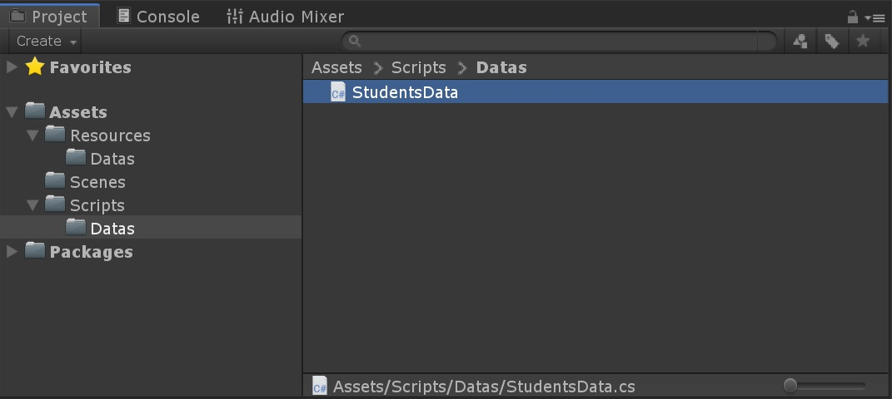

   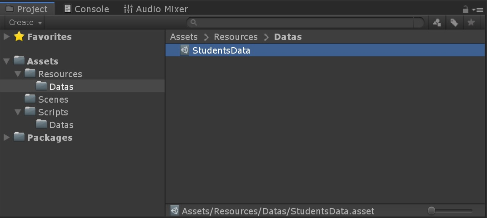

   其中StudentsData.cs

   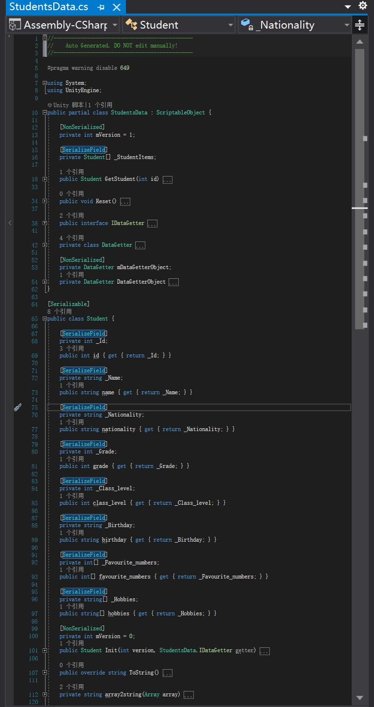

   其中StudentsData.asset

   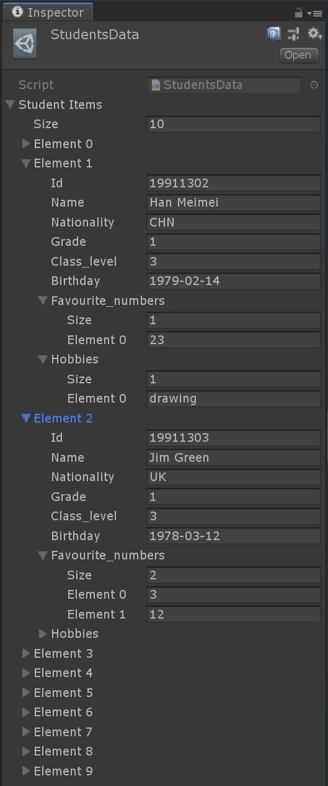

10. 新建测试代码TestExcelToSO.cs

    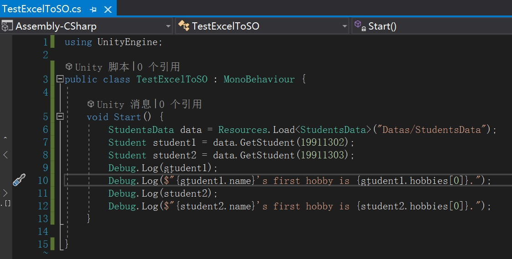

11. 运行代码以测试结果

    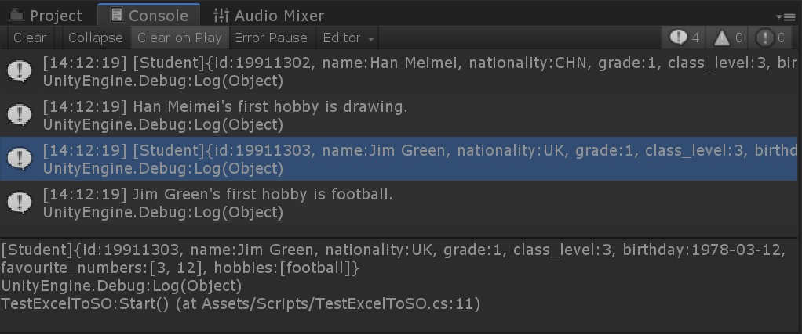

