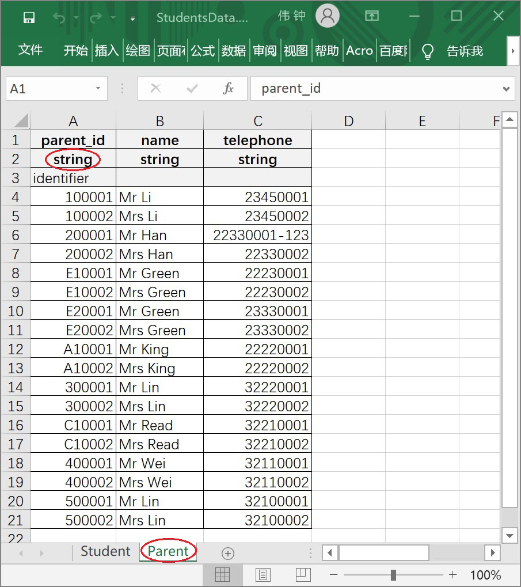
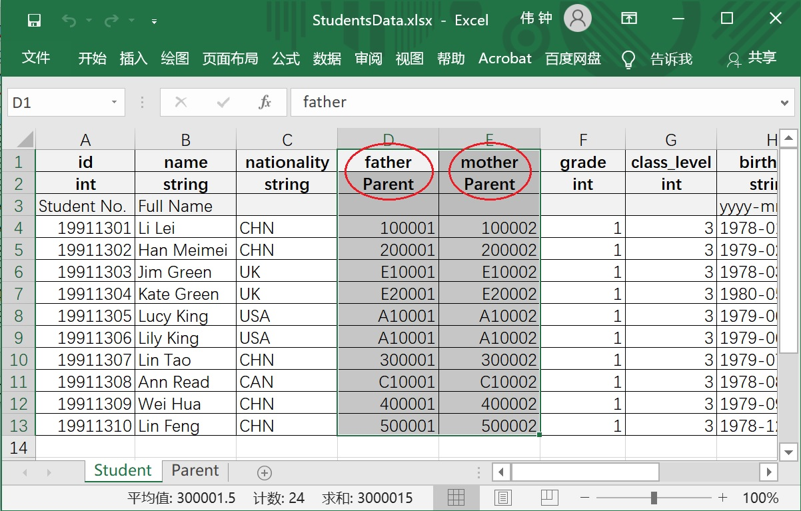
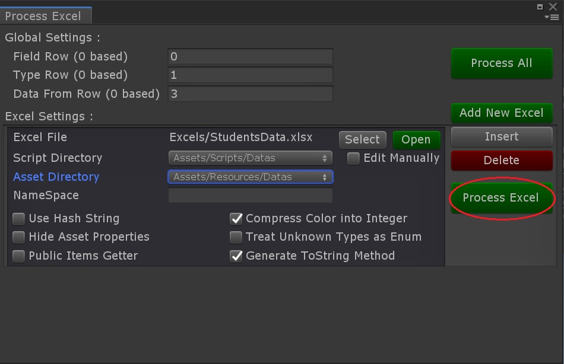
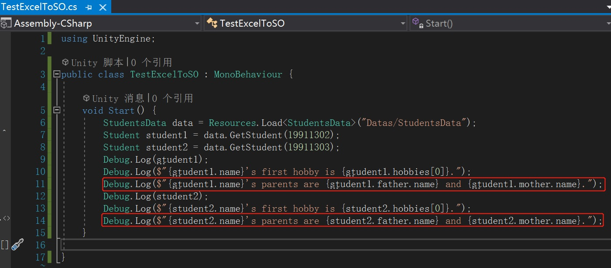
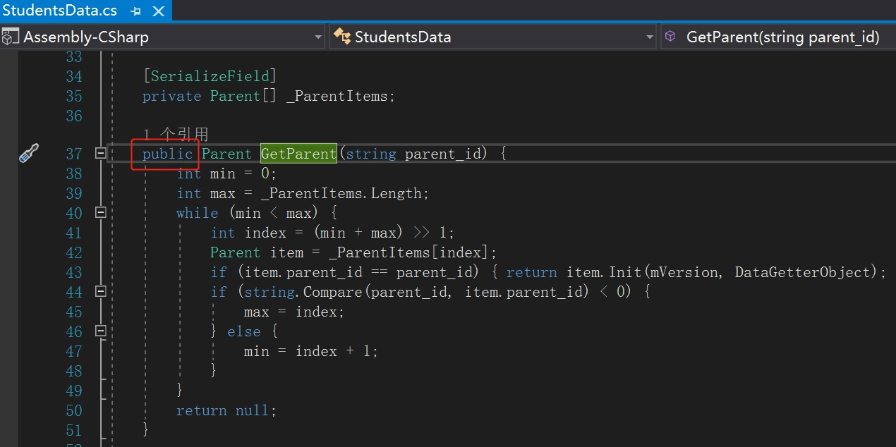
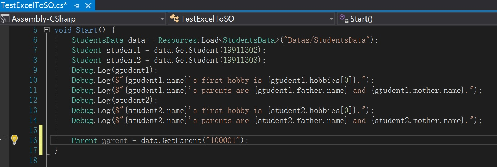
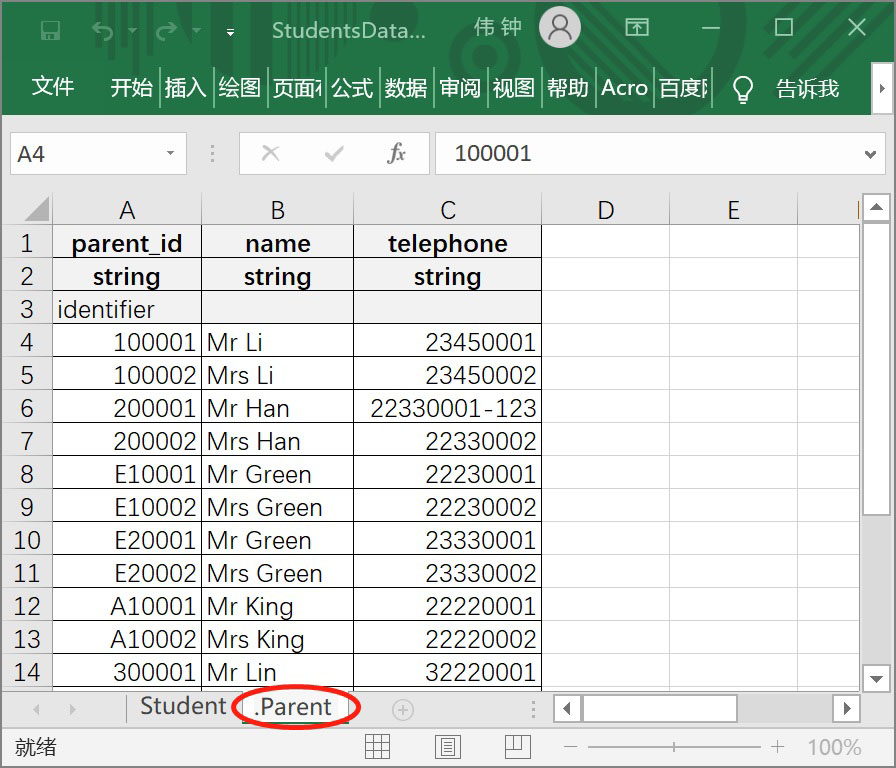
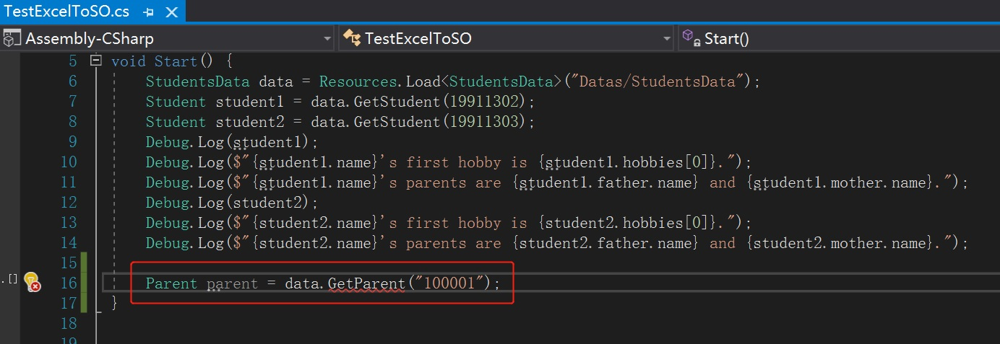

# Using nested types

## We Assume You've Finished

Finished the guidance [Reading data in Unity which fulfilled in a new xlsx file](./Guide1E1_EN.md)

## Guiding in Progress

1. Create a new sheet named "Parent" in "StudentsData.xlsx", and fill the sheet with data as the following image.
   
   

2. Insert two columns in "Student" sheet, with the field name "father" and "mother", with their types both Parent. Fill the two columns with the key corresponding to the parent_id in "Parent" sheet.
   
   

3. Back to Unity and execute "Process Excel" again.
   
   

4. Modify TestExcelToSO.cs to test parents data.
   
   

5. Run the code and check Console window for result.
   
   

6. Hide method "GetParent"
   
   Currently, the method StudentsData.GetParent is a public method.
   
   
   
   The method GetParent can be successfully invoked.
   
   
   
   Open "StudentsData.xlsx" and rename the sheet "Parent" into ".Parent". And then go back to Unity and execute "Process Excel" again.
   
   
   
   An compile error occurs ! "GetParent" method is invalid now.
   
   
   
   After resolving the compile error, DO NOT forget to **re-execute "Process Excel"** to make the data asset file accurate.
