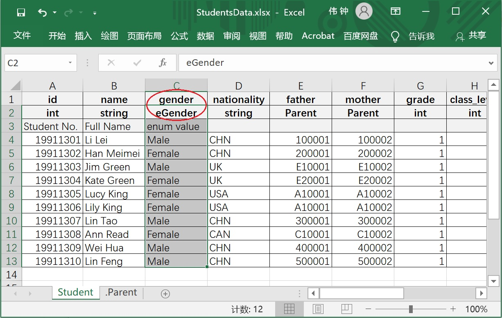
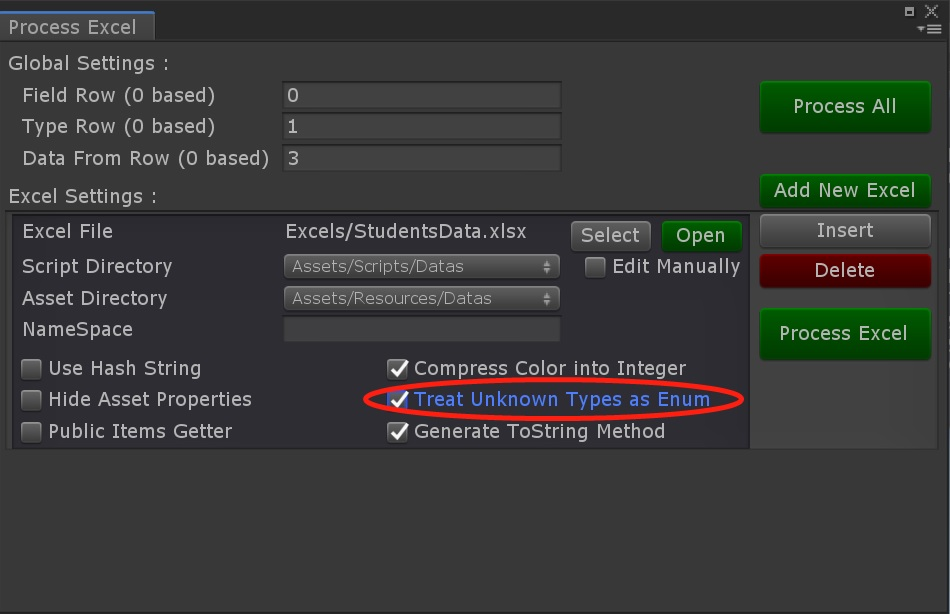
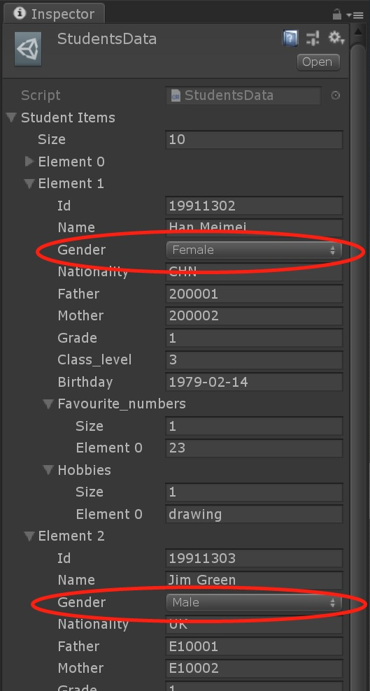
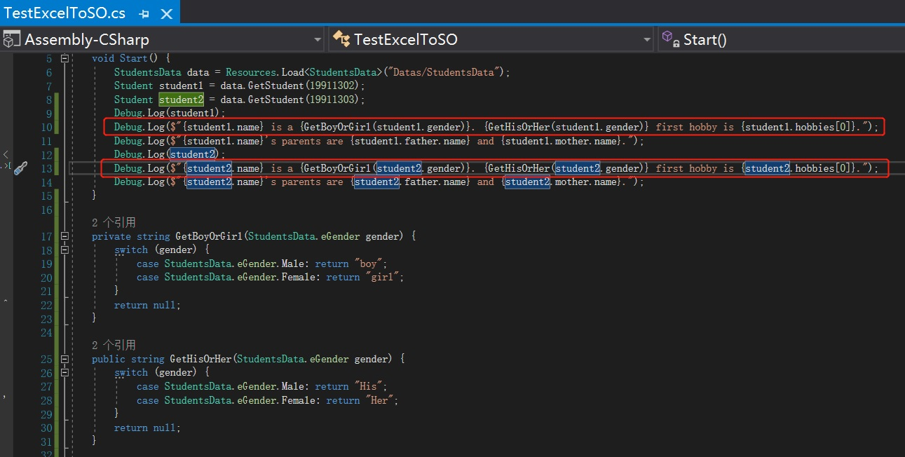
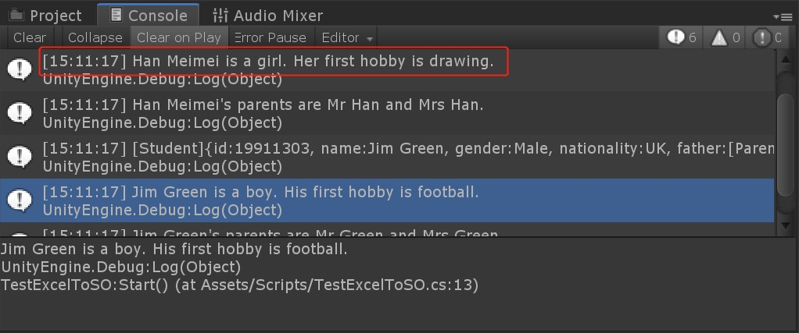
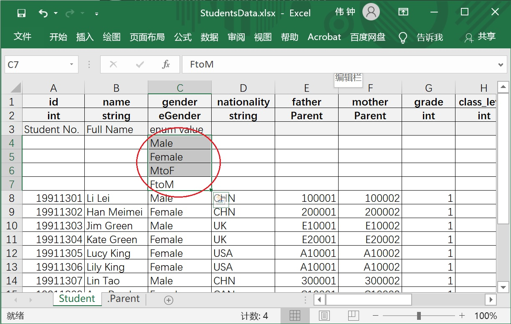
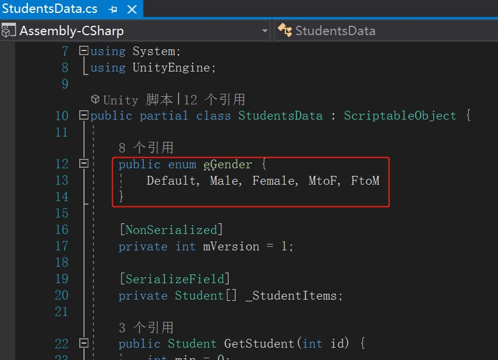

# 使用枚举类型

## 准备工作

完成[使用数据类型嵌套](./Guide1E2_CN.md)中的内容

## 操作流程

1. 在StudentsData.xlsx表格文件的Student表中新增一列，命名为gender，类型为eGender，并将学生性别（Male或Female）填入到表格中。

   

2. 回到Unity，在工具配置界面中勾选此Excel文件的“Treat Unknown Types as Enum”，使其支持自定义的枚举类型。

   

3. 运行“Process Excel”，重新生成脚本及数据。

   此时的数据资源文件：

   

4. 修改测试代码，根据学生性别丰富打印内容。

   

5. 运行代码并查看控制台输出。

   

6. 预定义枚举值，以保证在没有使用此枚举值时，代码中仍有定义。

   在StudentsData.xlsx表格文件的Student表中首行数据前适当增加空行，保证最左列为空，并在枚举类型的那一列填写枚举值，每个枚举值独占一行。

   

   若数据行最左列（指定id或key的一列）为空，此工具会认为该行无数据。

   枚举类型的所有枚举值为该xlsx文件中所有该类型枚举值字段中出现过的值的集合。
   
   运行“Process Excel”重新生成脚本和数据资源后，eGender枚举类型定义如下：
   
   

**注：** 所有自定义的枚举类型都包含Default值，用于未指定枚举值的情况。

