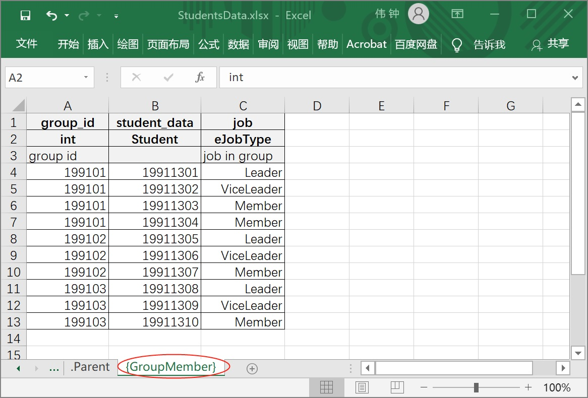
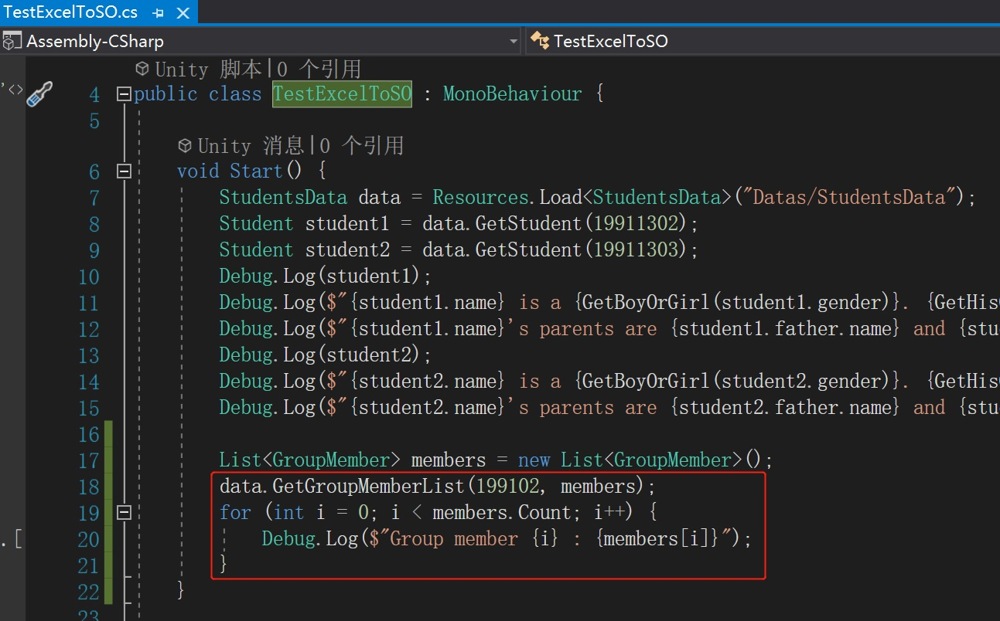
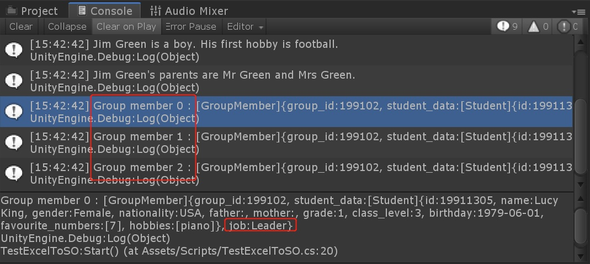

# 标识某张表为一键对多值并读取与键对应的全部数据

## 准备工作

完成[使用枚举类型](./Guide1E3_CN.md)中的内容

## 需求说明

此示例中，我们将StudentsData.xlsx表格文件Student表中的学生进行分组，并对组员数据进行定义。

其中组员数据包括：成员（Student类型），组内职务（job）。

此示例中我们将使用**一键对多值**特性，通过组id对该组内所有成员进行查找。

## 操作流程

1. 在StudentsData.xlsx表格文件新增一个Sheet，并命名为{GroupMember}、GroupMember{}、[GroupMember]或GroupMember[]。

   **注：** 其中大括号“{}”或中括号“[]”用于标识该sheet中的数据为一键对应多值。由于不同表格软件对Sheet名称中中括号的兼容性问题，不能保证中括号被正常使用，故在此工具中定义Sheet名称时，使大括号具有与中括号相同的功能。本示例使用{GroupMember}。

2. 填写{GroupMember}表中的数据类型及内容。

   

3. 回到Unity中并重新运行“Process Excel”。

4. 在TestExcelToSO.cs的Start方法中追加如下代码：

   

5. 运行测试，并查看控制台输出。

   
