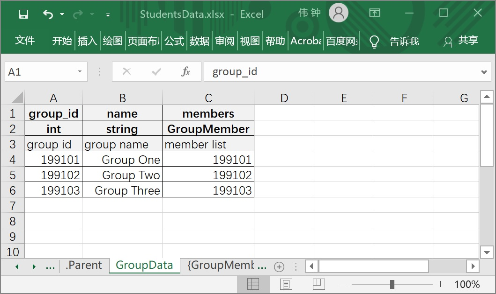
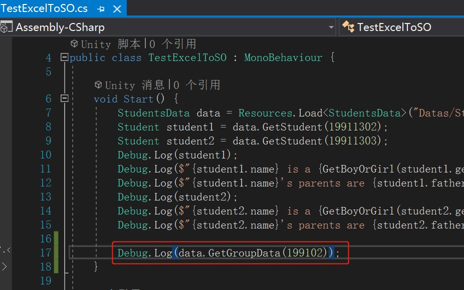
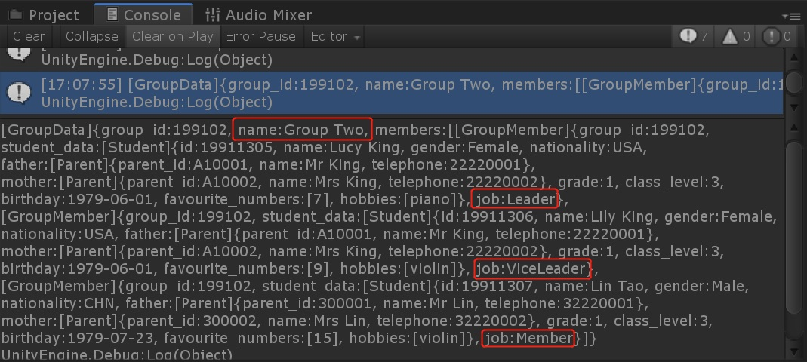
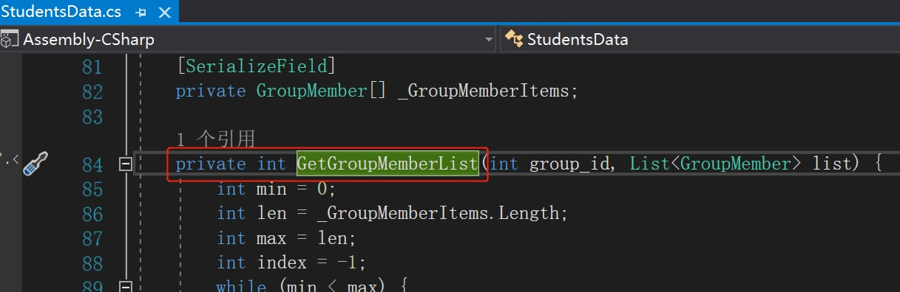

# 在使用数据类型嵌套时，被引用的自定义数据类型为数组的情况

## 准备工作

完成[标识某张表为一键对多值并读取与键对应的全部数据](./Guide2E1_CN.md)中的内容

## 需求说明

通常情况下，在使用数据数据类型嵌套时，若xlsx文件中已定义MyData类型，在另一个Sheet中定义以MyData数组为类型的字段datas时，其类型名称为MyData[]或[MyData]，此时datas字段类型必然为数组类型（MyData[]）。

若在MyData类型定义为一键对多值时，即使datas字段的类型未定义为数组，datas也将为数组类型（MyData[]）。

此示例中，我们将在StudentsData.xlsx表格文件中新增GroupData来定义上一示例中对学生进行的分组，并在此数据中定义类型为GroupMember的成员列表。

## 操作流程

1. 在StudentsData.xlsx表格文件新增一个名为GroupData的Sheet，并填充数据。

   

3. 回到Unity中并重新运行“Process Excel”。

4. 在TestExcelToSO.cs的Start方法中删掉上例中的代码，并追加如下代码。

   

5. 运行测试，并查看控制台输出。此时members为GroupMember[]数组类型。

   

5. 此时，已不再需要通过接口获取GroupMember列表，故可将获取GroupMember列表的接口进行隐藏。修改在StudentsData.xlsx表格文件中“{GroupMember}”Sheet的名称为“.{GroupMember}”。

   

6. 回到Unity中并重新运行“Process Excel”。

7. 此时，生成的代码StudentsData.cs中，GetGroupMemberList方法将被定义为private。

   