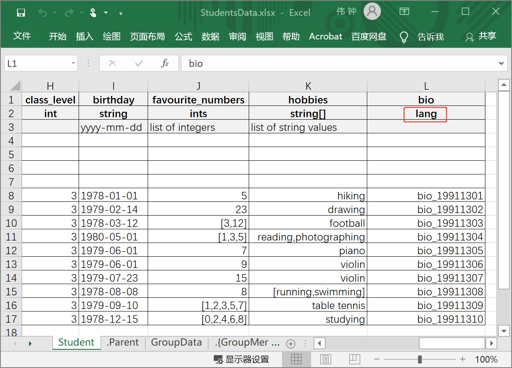
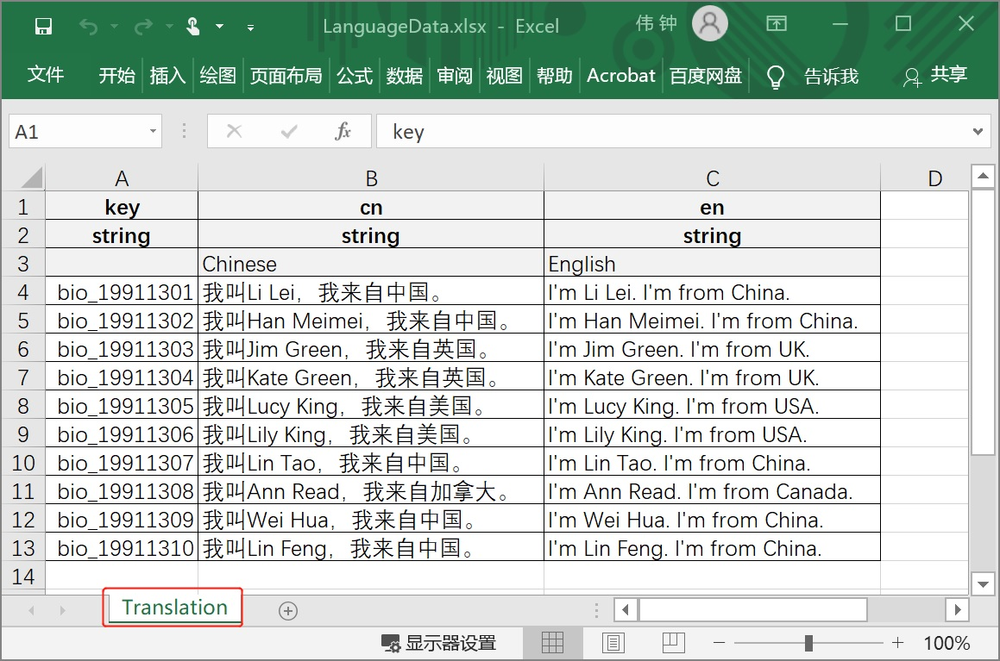
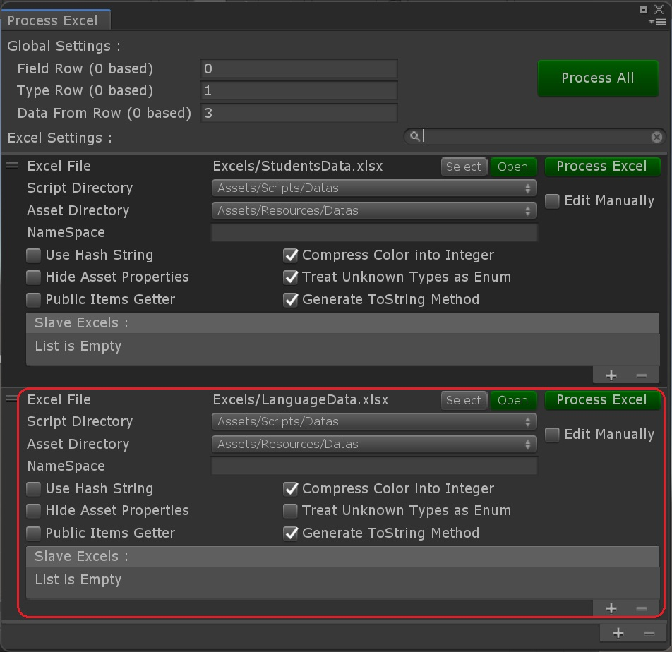
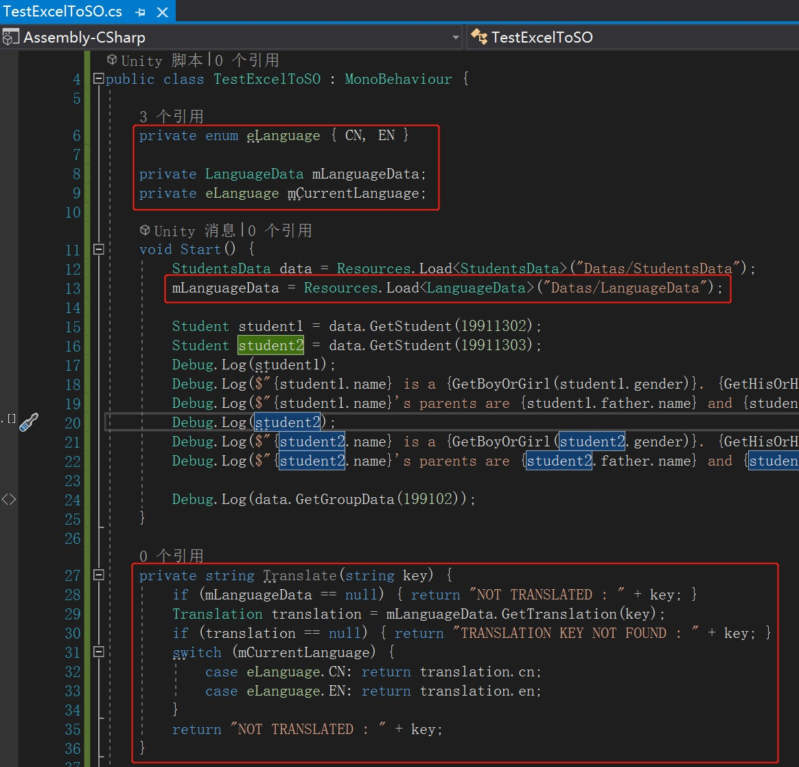
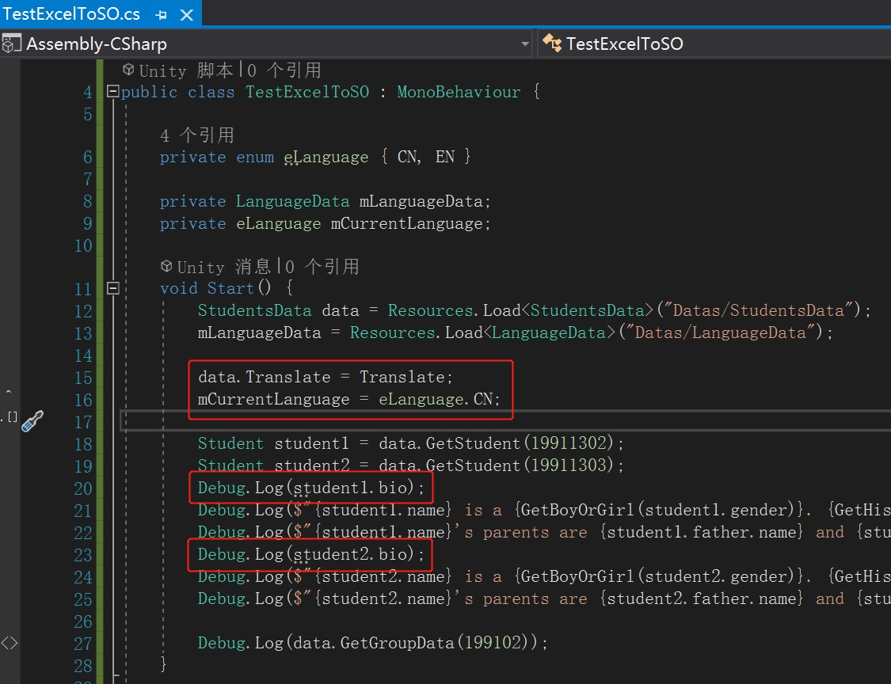
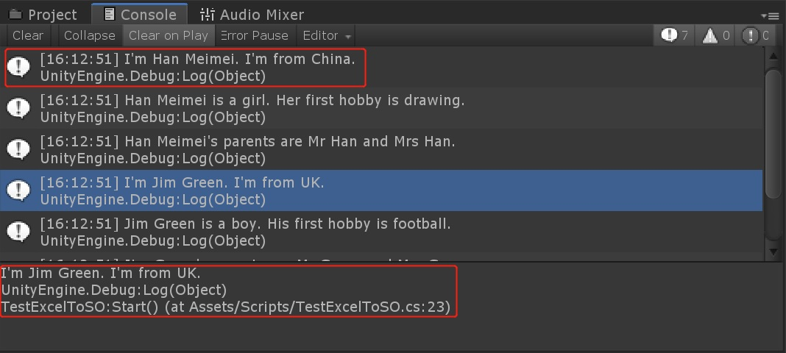

# Multi-Language feature

## We Assume You've Finished

Finished the guidance [Reading data in Unity which fulfilled in a new xlsx file](./Guide1E1_EN.md) or latter

## Demands in Guiding

In this guide, we are going to add a personal introduction, named bio, to each of the students. It is a multi language text using "multi-language feature".

We'll also create a new xlsx file that contains all Chinese and English contents to all multi-language keys.

## Guiding in Progress

1. Open "StudentsData.xlsx" and add a new field named "bio" to "Student" sheet and set its type "lang". And fill the bio of all student with multi-language keys.

   

2. Create a new xlsx file named "LanguageData.xlsx" in the folder that "StudentsData.xlsx" exists. And rename its unique sheet to "Translation", and fill all the student bios into the sheet.

   

3. Go back to configuration window in Unity and add a new Excel item, select "LanguageData.xlsx" and configurate its properties such as script directory and so on.

   

4. Execute "Process Excel" to both xlsx file or click "Process All". Make sure everything works well.

5. Open "TestExcelToSO.cs", add codes to load "LanguageData" and write a translation method. 

   

6. Specify the translation method of StudentData instance to yours. Print students' bio to check the multi-language text.

   

7. Go back to Unity and run the code in TestExcelToSO.cs. Check Console window for result.

   

