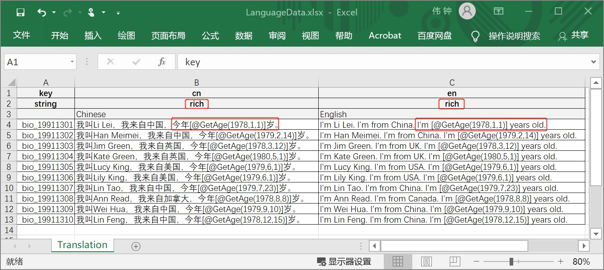
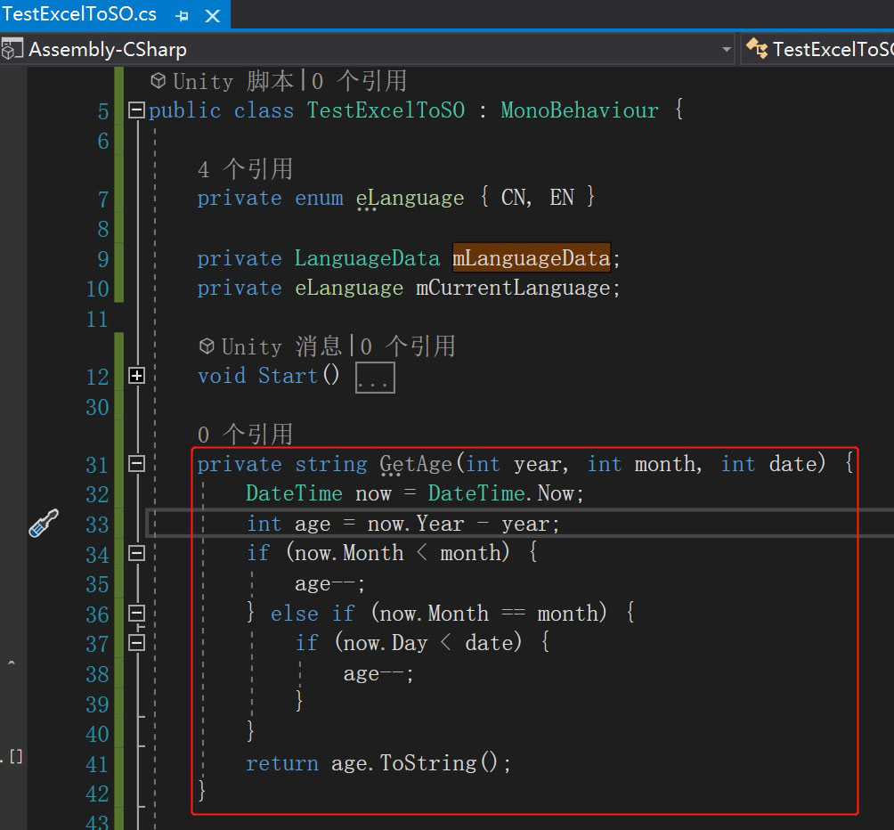
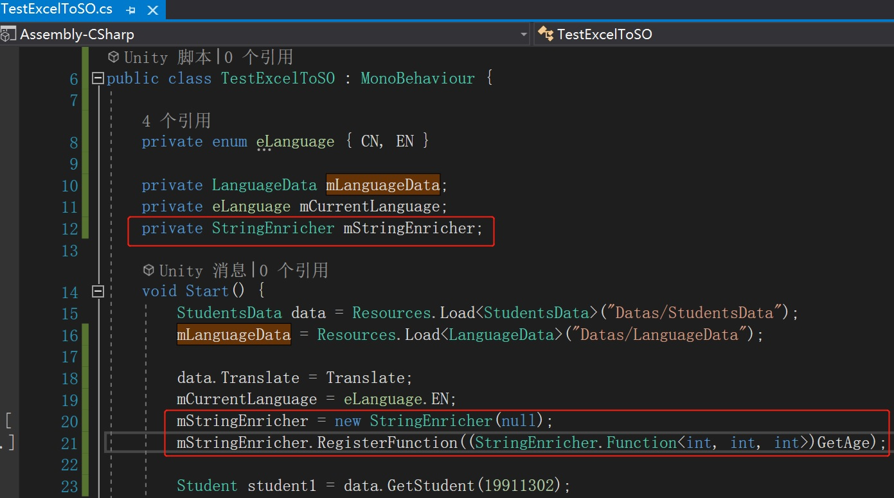
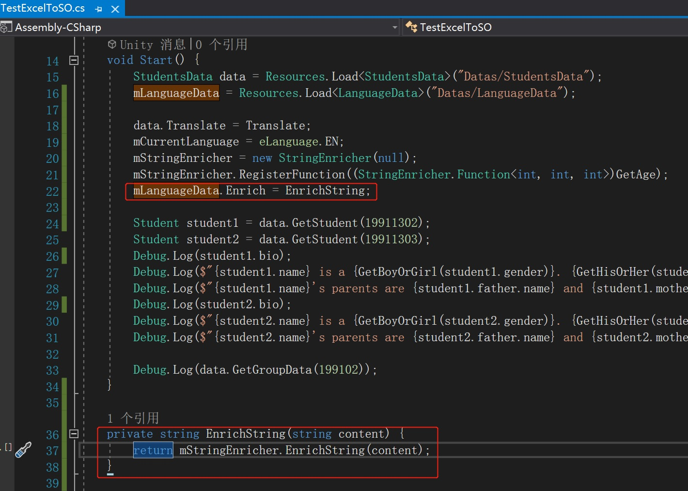
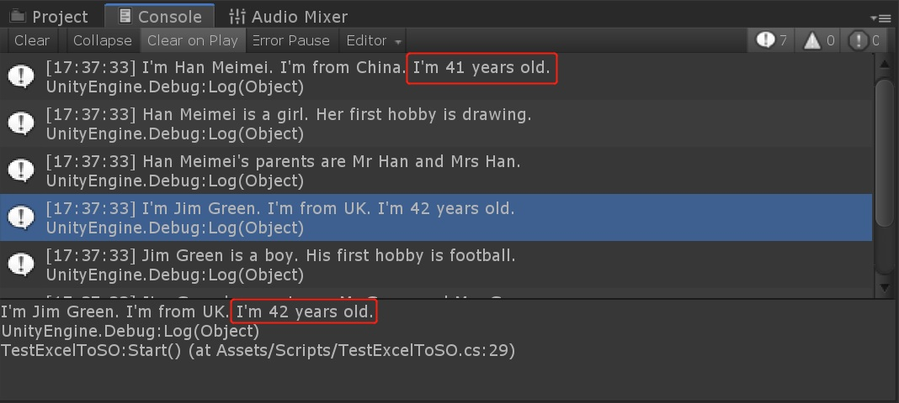

# Logical Rich-Text feature

## We Assume You've Finished

Finished the guidance [Multi-Language feature](./Guide3E1_EN.md)

## Demands in Guiding

We are going to add age description in students' bio. The age will be calculated according to their birthday in bio text and the time that the data items are initialized in runtime with out method "string GetAge(int year, int month, int date)".

We are going to use another tool of mine, StringEnricher, which is a part of https://github.com/greatclock/reflection_tools.git. Its used to replace the replacement part in a string to enrich a text content at runtime. The replacement part can be a variable or a function call with parameters. Reflection will be used to retrieve values of variables or function returns.

If you're going to follow this guide with this my StringEnricher, import it into your project first.

## Guiding in Progress

1. Open "LanguageData.xlsx" and select the sheet "Translation". Change the type of "cn" and "en" from string to "rich". And append their age descriptions to the bios.

   

2. Go back to Unity and re-execute "Process Excel" to "LanguageData.xlsx".

3. Open "TestExcelToSO.cs", Add a new method "string GetAge(int year, int month, int date)".

   

4. Create an instance of StringEnricher, and register "GetAge" to it for enrichment method.

   

5. Specify Enrich method of LanguageData instance to your enrichment method, which invokes instance of StringEnricher to enrich the content.

   

6. Go back to Unity again and run the code in "TestExcelToSO.cs". Check Console window for the result.

   